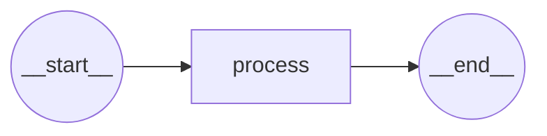
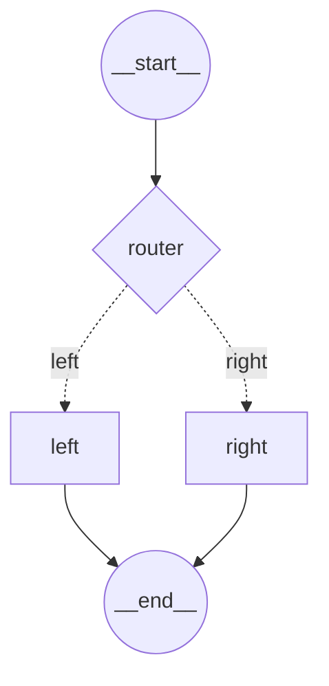
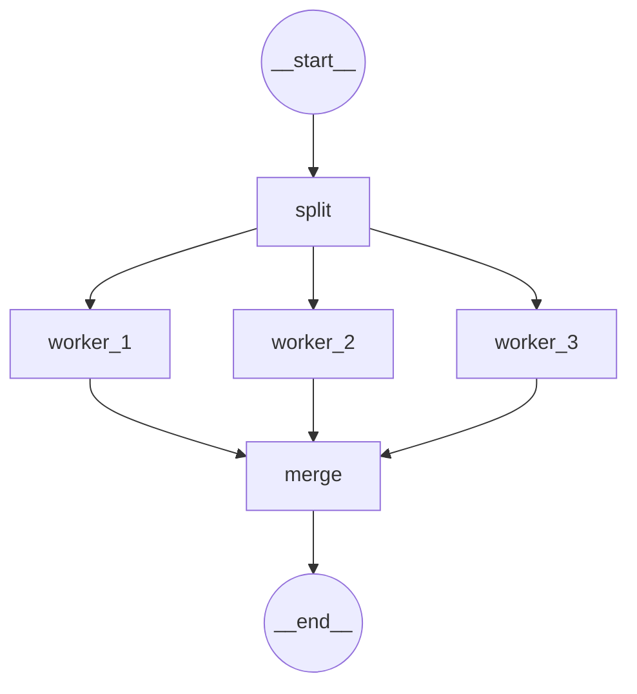

# Mermaid Flowchart Example

This example demonstrates how to generate [Mermaid](https://mermaid.js.org/) flowchart diagrams from AgentMesh graphs.

## Features

- Generate visual representations of your graphs
- Support for different layouts (TD, LR, BT, RL)
- Automatic node shape selection:
  - **Stadium** shape for START/END nodes
  - **Diamond** shape for conditional routing nodes
  - **Rectangle** shape for standard processing nodes
- Conditional edges shown as dotted lines with labels
- Special character handling

## Usage

### From Graph Directly

```go
var StatusKey = graph.NewKey("status", "")

g := graph.New(StatusKey)

g.Node("process", func(ctx context.Context, scope graph.Scope) (*graph.Command, error) {
    return graph.Set(StatusKey, "done").End()
}, graph.END)

g.Start("process")

compiled, _ := g.Build()

// Generate Mermaid diagram
mermaid := compiled.MermaidFlowchart("TD")
fmt.Println(mermaid)
```

## Direction Options

- **TD** (top-down) - Default
- **LR** (left-right)
- **BT** (bottom-top)
- **RL** (right-left)

## Viewing the Diagrams

Copy the generated Mermaid code and paste it into:

1. **Mermaid Live Editor**: https://mermaid.live/
2. **GitHub Markdown**: Wrap in ` ```mermaid ... ``` ` code blocks
3. **VS Code**: Install the Mermaid extension
4. **Documentation sites**: Many support Mermaid (GitBook, Docusaurus, etc.)

## Example Output

### Simple Workflow


### Conditional Routing


### Parallel Execution


## Running the Example

```bash
go run examples/mermaid_flowchart/main.go
```

This will output four different workflow examples demonstrating various graph patterns.

## Use Cases

- **Documentation**: Visualize your graph architecture
- **Debugging**: Understand complex workflows
- **Planning**: Design workflows before implementation
- **Communication**: Share graph structures with team members
- **Testing**: Verify graph topology is correct
